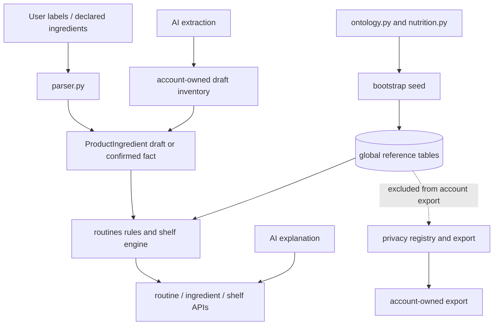

# V3-02 Evidence & Ingredient Intelligence Foundation

**Status:** architecture audit only (V3-02.0)
**Baseline:** `main` at `53296f8a2cac39ca1cfafb7805a4197c056d5a8d`
**Branch:** `v3/v3-02-evidence-foundation`

This document records the repository truth at the V3-02 baseline and proposes a
future evidence contract. It does not add tables, migrations, endpoints,
dependencies, parsers, safety rules, RAG, or product behaviour.

## 1. Executive summary

GlamGenius already has a useful deterministic ingredient/routine foundation. The
runtime ontology in `backend/app/domains/routines/ontology.py` is the canonical
parser/rule input; `backend/app/bootstrap/__init__.py` mirrors much of it into
global reference tables. User product facts are separate and account-owned.
Low-confidence extraction is explicitly draft-only, and warnings carry a
deterministic `rule_id`.

The current system is curated internal knowledge, not a structured scientific
evidence system. Words such as “reviewed” in comments describe internal curation
and safety review; they do not prove clinical verification, regulatory approval,
or independent validation. Existing operational rules should therefore be
classified as `legacy_curated` until a future evidence record is deliberately
linked and approved. No evidence should be backfilled merely from prose already
in the repository.

The recommended permanent shape is a shared Evidence domain containing source
identity, claims, links, provenance, review lifecycle, and supersession. Skin,
Hair, Home Care, Nutrition, Supplements, Product Quality, and Purchase
Intelligence remain owning domains for behaviour. Evidence is an input and audit
trail, not a generic rule engine or product-quality score.

## 2. Current repository truth

### 2.1 Current data-flow



The AI gateway may extract or explain structured data, but it is not the source
of the deterministic compatibility, contraindication, sensitivity, or routine
rules. `backend/app/domains/routines/explanation.py` validates explanatory
language after the deterministic result exists; it does not choose products or
invent warnings.

### 2.2 Exact paths audited

| Concern | Current path(s) | Finding |
| --- | --- | --- |
| Ingredient ontology | `backend/app/domains/routines/ontology.py` | In-process canonical catalogue, aliases, families, compatibility, slots, climate and perfume conventions. |
| Relational routine/reference models | `backend/app/domains/routines/models.py` | `Ingredient`, `IngredientAlias`, `IngredientRule`, `CompatibilityRuleRow`, `ContraindicationRule`, `RoutineTemplate`, `PerfumeContextRule`, `AppearanceNutritionRule`, `ProductIngredient`, routine provenance models. |
| Additional reference models | `backend/app/domains/reference/__init__.py` | Seed audit, routine steps, supplement context, contraindication and sensitivity rows, inventory subtype definitions. |
| Ingredient parser | `backend/app/domains/routines/parser.py` | Normalises text, longest-first alias matching, confidence and confirmation boundary, unmatched terms. |
| Rule evaluation | `backend/app/domains/routines/rules.py` | Deterministic allergy, compatibility, expiry, slot, low-use and unconfirmed findings; every finding has `rule_id`. |
| Shelf/product intelligence | `backend/app/domains/routines/shelf.py`, `backend/app/domains/routines/service.py`, `backend/app/api/v2/shelf.py` | Confirmed inventory only drives compatibility; overlap, expiry, low-use and supplement flags are computed. |
| Routine generation | `backend/app/domains/routines/compiler.py`, `service.py`, `schemas.py`, `api/v2/routines.py` | Compiles owned products into routines and records `knowledge_version`/engine metadata. |
| Nutrition | `backend/app/domains/routines/nutrition.py`, `api/v2/routines.py` | Qualitative nutrient associations and common foods with diet filtering; no quantities or RDA/EAR/TUL engine. |
| Supplement context | `backend/app/bootstrap/__init__.py`, `backend/app/domains/reference/__init__.py`, `backend/app/domains/routines/shelf.py`, `safety.py`, `api/v2/routines.py` | General inventory/wellness context, expiry and professional-boundary flags; no dosage, deficiency diagnosis or prescribing. |
| Product extraction | `backend/app/domains/inventory/extraction.py`, `inventory/service.py`, `inventory/models.py`, `api/v2/inventory.py` | AI extraction creates account-owned draft records with model/prompt/schema provenance and confirmation state. |
| Product ingredient persistence | `backend/app/domains/routines/models.py`, `api/v2/routines.py` | `ProductIngredient` is account-owned and linked to canonical ingredient keys; `source`, `confidence`, `needs_confirmation`, `confirmed_at`. |
| Product Check / shopping | `backend/app/domains/recommendation/service.py`, `orchestrator.py`, `explanation.py`, `roi.py`, `models.py`, `api/v2/shopping.py` | Purchase evaluation is account-owned and versioned by `ROI_VERSION`; it is not evidence-backed product quality. |
| Style compatibility | `backend/app/domains/recommendation/compatibility.py`, `ranking.py`, `orchestrator.py` | Apparel/style compatibility, not ingredient safety. Keep ownership separate. |
| Reference seed | `backend/app/bootstrap/__init__.py`, CLI wrapper `backend/app/bootstrap/reference_data.py` | Idempotent, versioned seed; `SEED_VERSION = "2026.02.16"`; records `seed_version_records`. |
| Privacy/export | `backend/app/domains/privacy/__init__.py`, `export.py`, `deletion_service.py`, `api/v2/privacy.py` | Explicit table registry separates `INCLUDED`, operational, secret and `NOT_USER_OWNED`; global reference tables are excluded from account export. |
| Critical/regression tests | `backend/tests/test_domain_routines.py`, `test_reference_data_seed.py`, `test_critical_journey*.py`, `test_privacy*.py` | Tests cover seed parity/idempotence, parser/rule boundaries, account isolation and export classification. |

## 3. Current source-of-truth matrix

| Knowledge | Current code source | DB table | Seed source | Runtime consumer | Truth classification |
| --- | --- | --- | --- | --- | --- |
| Ingredients | `ontology.INGREDIENTS` | `ingredients` | `seed_ingredients()` mirrors ontology | parser, routines service, ingredient API | Code-owned curated catalogue mirrored to DB |
| Aliases / INCI spellings | `ontology.alias_index()` | `ingredient_aliases` | `seed_ingredients()` | parser and ingredient lookup | Derived from ontology; DB mirror |
| Ingredient families | `Ingredient.family` in ontology | `ingredients.family` | ontology mirror | compatibility, overlap, slot/routine logic | Curated categorical data |
| Single-ingredient notes | `IngredientRule` model exists; no active ontology/seed consumer found | `ingredient_rules` registered/excluded in privacy registry | No active seed function found | No current runtime consumer found | Stale/dead model surface; not evidence |
| Pairwise compatibility | `ontology.COMPATIBILITY_RULES` | `compatibility_rules` | `seed_ingredients()` | `rules.compatibility_findings()` | Curated internal rules; operational |
| Contraindications | `CONTRAINDICATION_DEFS` in `bootstrap/__init__.py` | `ingredient_contraindication_rules` | `seed_contraindications()` | Seed/test/reference consumers; not a generic external evidence link | Curated safety rules |
| Sensitivity | `SENSITIVITY_DEFS` in `bootstrap/__init__.py` | `ingredient_sensitivity_rules` | `seed_sensitivities()` | Seed/test/reference consumers; softer cautions | Curated sensitivity rules |
| Routine templates | `ROUTINE_TEMPLATE_DEFS`/`ROUTINE_STEP_DEFS` in bootstrap | `routine_templates`, `routine_template_steps` | `seed_routine_templates()` | compiler/service/UI | Curated product behaviour |
| Skin/Hair steps | bootstrap step definitions plus ontology slots | template tables and compiled account routines | `seed_routine_templates()` | compiler and routine API | Curated operational guidance |
| Appearance nutrition | `NUTRIENT_RULES`/food lists in `nutrition.py`; `AppearanceNutritionRule` model is not actively seeded | `appearance_nutrition_rules` registered as global | No active appearance-rule seed found | `nutrition.suggestions()` reads module constants | Hardcoded qualitative curated content |
| Supplement context | `SUPPLEMENT_CONTEXT_DEFS` in bootstrap and safety constants | `supplement_context_rules`, `supplement_safety_flags` | `seed_supplement_context()` | shelf and supplement API | Curated general context; user flags are derived/account-owned |
| Perfume context | `PERFUME_RULES` in ontology and `PERFUME_CONTEXT_DEFS` in bootstrap | `perfume_context_rules` | `seed_perfume_context()` | perfume service/API | Curated convention, explicitly not chemistry evidence |
| Product ingredient matching | parser plus user details | `product_ingredients` | Not global-seeded; created from account products | shelf/rules/ingredient APIs | User-confirmed or draft user fact |
| Product quality / shopping | recommendation modules and ROI constants | `purchase_evaluations`, factors, decisions | No evidence seed | shopping API | Account-owned evaluation, not verified evidence |
| EvidenceSource / EvidenceClaim / links / RuleEvidenceLink | **Not implemented in V3-02.0** | None | None | None | Proposed shared provenance architecture only |

### 3.1 Duplicate and drift risks

There are two intentional but fragile representations of some reference data:
the executable ontology/constants and relational seed tables. The seed tests
currently protect ingredient/alias/compatibility parity, and seed version rows
protect replay visibility. However, `IngredientRule`, `ContraindicationRule`,
and `AppearanceNutritionRule` in `routines/models.py` are not the same as the
active `domains/reference` tables/constants and appear to be legacy surfaces.
The architecture must not add a third copy in an Evidence table.

The current version mechanism is fragmented: `phase6-v1` ontology/routine
versions, date-like `SEED_VERSION`, planning/recommendation engine versions,
AI prompt/schema versions, and API/export schema versions. These are useful
provenance fragments but cannot answer the complete question “which source and
evidence release produced this recommendation?”

No AI-generated safety rule or evidence claim was found. AI outputs are stored
as account-owned `ai_runs`/outputs or draft inventory and are filtered by
structured schemas and safety checks.

## 4. Existing ingredient architecture

`ontology.Ingredient` contains `key`, display name, INCI name, family, summary,
common use and aliases. The alias index includes the canonical key, display and
INCI forms plus explicit aliases. `parser._match_in()` sorts aliases by length,
uses case-normalised text and word boundaries, removes matched text before
shorter matching, and preserves label position. `parse_product()` gives the
user-declared active list precedence over label text and de-duplicates by
canonical key.

The relational `Ingredient` table mirrors the ontology. `ProductIngredient` is
not global knowledge: it belongs to an account and inventory item, stores the
matched text/position, confidence and source, and requires confirmation below
the threshold. Unknown label text is surfaced by `unmatched_terms()` rather
than mapped to a nearby ingredient. This is the correct boundary to preserve.

### Ingredient gap classification

| Future attribute | V3-02 foundation | V3-03 Skin/Hair | V3-05 Product Quality | Decision |
| --- | --- | --- | --- | --- |
| Canonical INCI identity and stable key | Yes: evidence subject seam and stable identity contract | No new behaviour | Label/formulation joins later | Extend identity deliberately, do not duplicate parser keys |
| Marketing aliases / regional spellings | Yes: provenance-aware alias ownership contract | No | Label ingestion may add candidates | Unknown remains unknown |
| Ingredient family | Yes: controlled subject reference | Domain-owned | Formulation interpretation later | Keep family out of EvidenceClaim prose |
| Skin applicability / hair applicability | No behaviour yet; claim subject type only | Yes | Product context may qualify | Domain rule, not generic evidence field |
| Rinse-off vs leave-on | No | Yes | Product formulation context | Domain/product seam |
| Functional categories | Claim vocabulary candidate | Yes | Yes for formulation assessment | Controlled category, never arbitrary safety prose only |
| Concentration known/unknown | No | Domain rule input later | Yes, label/formulation provenance | Evidence cannot infer concentration |
| pH / vehicle relevance | No | Domain rule input later | Product formulation | Must remain unknown when absent |
| Fragrance/allergen context | Subject/claim category only | Yes | Label verification | Jurisdiction-sensitive and not universal |
| Cosmetic / OTC / regulated / professional context | Yes: controlled regulatory-context vocabulary | Domain handling | Product jurisdiction | Required boundary before stronger claims |

## 5. Existing nutrition architecture

`backend/app/domains/routines/nutrition.py` defines qualitative
`NutrientRule` records and common Indian `Food` sources. `suggestions()` resolves
diet aliases, filters foods, returns rule IDs, context and a safety disclaimer,
and rejects unsafe language. There are no numerical nutrient quantities,
RDA/EAR/TUL values, deficiency diagnoses, calorie targets, or food-composition
lookups. `NutritionPreference` and `HydrationPreference` are account-owned
constraints/preferences. V3-02 must preserve this behaviour and classify it as
`legacy_curated_general_wellness`, not promote it to approved nutrition
evidence. Quantitative nutrition belongs to V3-04.

## 6. Existing supplement architecture

Supplement inventory uses `inventory_items` plus account-owned
`supplement_details` and `supplement_safety_flags`. Seeded global context rows
are `SupplementContextRule` with `context_key`, guidance, `safety_category` and
seed version. The safety module permits only inventory dates, general context,
professional-boundary wording and pregnancy flags. It explicitly rejects dose,
effect, diagnosis, treatment, prescription and medication-substitution claims.
V3-02 may define provenance seams; it must not add dosing, deficiency treatment,
or prescribing.

## 7. Existing parser and confirmation architecture

The parser uses `SOURCE_USER`, `SOURCE_LABEL`, and `SOURCE_EXTRACTED` with base
confidence `1.0`, `0.85`, and `0.55`; `CONFIRMATION_THRESHOLD = 0.6`. A low
confidence row is returned as `needs_confirmation` and cannot drive a
compatibility warning until the user confirms it. Position is retained for
label parsing; declared ingredients have no position. Duplicate canonical keys
are collapsed in `parse_product()`, with declared values winning.

V3-02.1 should keep parser output as a deterministic candidate fact. LLMs may
assist extraction into a draft, but an unknown token must remain unknown and
must never be nearest-neighbour mapped into `ingredients`.

## 8. Domain ownership decision

### Evidence domain owns

Source identity and metadata, source version/publication dates, jurisdiction,
source type, citations/locators, structured claim provenance, evidence
classification, review lifecycle and supersession. A formal evidence-release
snapshot is a later seam, not a V3-02.1 responsibility.

### Domain owners retain behaviour

Skin/Hair/Home Care own ingredient behaviour, placement, compatibility,
frequency, order, sensitivity, environment interaction and action guidance.
Nutrition owns nutrient requirements, food composition, serving contribution and
diet filtering later. Supplements own label quantities, duplicate exposure,
RDA/TUL comparison and regulatory context later. Product Quality owns
formulation, label/claim verification, packaging/stability, lab provenance and
value/overlap. Purchase Intelligence owns user-facing purchase decisions.

Evidence may qualify or support a domain rule; it does not become a god-domain
containing every domain's behaviour.

## 9. Proposed shared Evidence model (design only)

The following is a minimum relational contract for V3-02.1. Names are proposed,
not implemented.

### 9.1 EvidenceSource

**Owner:** Evidence domain. **Purpose:** one exact reviewed source revision for
an external reference or independently obtained product-provenance reference.
Identity and revision history are separate concepts.

Required fields:

* `id` (UUID primary key), `source_key` (unique exact-revision key),
  `source_series_key` (stable family/series key), `source_type`, `publisher`,
  `title`, `jurisdiction`, `status`, `accessed_at`, and `license_or_use_note`;
* nullable `canonical_url`, `publication_date`, and `version_or_revision`;
* optional `supersedes_source_id`, `last_reviewed_at`,
  `next_review_due_at`, `created_at`, and `updated_at`.

Constraints/indexes: unique `source_key`; `source_series_key` is indexed but
not necessarily unique; `canonical_url` is indexed but **not unique** because
publishers commonly reuse a URL across revisions. Index `(source_type,
jurisdiction, status)` and `(next_review_due_at, status)`. Do not fabricate
publication dates or versions when the source does not provide them. No copied
source document body.

Versioning/review: `source_key` identifies the exact reviewed revision;
`source_series_key` groups revisions such as `icmr_nin_rda_2024` within
`icmr_nin_rda`. An updated regulation or label is a new source row linked by
`supersedes_source_id`; approval is a separate claim lifecycle decision.

Consumers: domain rule review tools and read-only domain services. It does not
own ingredient behaviour, product scores, user observations, or account data.

### 9.2 EvidenceClaim

**Owner:** Evidence domain, with domain-owner review. **Purpose:** one structured
assertion whose scope and status can be audited without pretending that source
count equals certainty.

Required fields:

* `id`, unique `claim_key`, `claim_version`, `domain`, `subject_type`,
  `subject_key`, `claim_type`, `summary`, and `scope`;
* `evidence_strength`, `strength_rationale`, `claim_status`, `review_status`,
  `regulatory_context`, `structured_value`, `created_at`, and `updated_at`;
* `reviewed_at`, `reviewed_by` (or an auditable stable reviewer reference),
  `last_reviewed_at`, `next_review_due_at`, optional `supersedes_claim_id`;
* `ai_generated` (provenance flag), `drafted_by_run_id` when applicable,
  with no implication that `ai_generated=false` means approved.

Constraints/indexes: unique `(claim_key, claim_version)`; foreign-key
self-reference for supersession; indexes on `(domain, subject_type,
subject_key, claim_status)` and `(review_status, next_review_due_at)`. A
`strength_rationale` is required whenever `evidence_strength` is assigned.
Claims marked `approved` must have `reviewed_by`, `reviewed_at`, and valid active
source links. `ai_generated=true` is never sufficient for approval, and
`ai_generated=false` is not proof of human approval. `summary` is explanatory
prose only; domain logic consumes controlled values and domain rules rather than
executing arbitrary text.

Consumers: domain-specific rule layers may select active approved claims within
their domain and scope. EvidenceClaim does not itself decide safety action,
dosage, compatibility, product quality, or a recommendation.

### 9.3 EvidenceClaimSource

**Owner:** Evidence domain. **Purpose:** many-to-many link between a claim and
the sources that support, qualify, limit, contradict or contextualise it.

Required fields: `claim_id`, `source_id`, `relationship`, `locator`,
`review_note`, `created_at`, `reviewed_at`, `reviewed_by`.

Constraints: unique `(claim_id, source_id, relationship, locator)`; foreign keys
to both records; `relationship` is controlled (`supports`, `qualifies`,
`limits`, `contradicts`, `background`). A claim cannot be approved if its links
are missing, inactive, or have no locator/review note where a locator is
available. Store concise structured summaries and short legally appropriate
quotes only; never bulk-copy papers, guidelines or paid databases.

### 9.4 RuleEvidenceLink

**Owner:** Evidence domain owns this provenance relationship; the referenced
domain owns rule behaviour. **Purpose:** connect an existing deterministic rule
to one or more reviewed claims without moving that rule into Evidence.

Proposed fields: `id`, `domain`, `rule_kind`, `rule_id`, `rule_version`,
`claim_id`, `relationship`, `created_at`, `reviewed_at`, and `reviewed_by`.
`rule_kind` is controlled and initially limited to values such as
`ingredient_compatibility`, `ingredient_sensitivity`,
`ingredient_contraindication`, `routine_guidance`, `nutrition_context`, and
`supplement_context`.

The narrower rule relationship vocabulary is `supports`, `qualifies`, `limits`,
and `background`. It deliberately excludes `contradicts`: contradictory source
material belongs on Claim↔Source and claim assessment until a domain owner
decides what it means for executable behaviour. A link can report that a rule
is evidence-linked; it cannot execute “therefore remove this product.”

The initial pilot must prove links such as a Skin/Hair rule
`ingredient.compat.retinoid_aha` connected to a reviewed claim, while leaving
the compatibility engine responsible for the actual finding.

## 10. Controlled vocabularies

Source types: `official_regulation`, `official_guideline`,
`government_reference`, `systematic_review`, `peer_reviewed_research`,
`professional_consensus`, `ingredient_reference_database`,
`manufacturer_label`, `manufacturer_technical_document`, `manufacturer_claim`,
`independent_lab_report`, `traditional_reference`, `other`.

In global EvidenceSource, the manufacturer/lab types mean independently
obtained public, official, or licensed reference material suitable for global
storage. A user's uploaded label, COA, batch report, receipt, or private photo
is never an EvidenceSource row. Product-specific account provenance is deferred
to V3-05 (for example, a future account-owned `ProductEvidenceArtifact`).

Evidence strength: `strong`, `moderate`, `limited`, `traditional_uncertain`,
`insufficient`. This is qualitative, never a numerical trust score and never
derived from source count. A reviewer rationale is required, and “strong” need
not mean the same thing across cosmetics, nutrition, regulation and
traditional-use evidence. AI cannot assign final strength.

Claim status: `supported`, `qualified`, `conflicting`, `unsupported`.

Review lifecycle: `draft`, `reviewed`, `approved`, `superseded`, `retired`.
Approval requires human/domain-owner review; AI-generated drafts may be
reviewed but cannot self-promote.

Source status: `active`, `superseded`, `retired`, `unavailable`.

Product provenance seam (future Product Quality):
`independent_lab_verified`, `manufacturer_coa_or_test`,
`regulatory_information_verified`, `ingredient_label_verified`,
`manufacturer_claim_only`, `insufficient_evidence`. This represents provenance,
not a product score.

Regulatory context: `cosmetic`, `otc_or_regulated`, `professional_guidance_required`,
`jurisdiction_sensitive`, `unknown`.

## 11. Review, AI and safety boundary

AI may summarise, explain, translate, or draft candidate source/claim records.
AI may not invent safety rules, interactions, clinical claims, RDA values, upper
limits, lab results or regulatory approvals. AI may not promote a draft to
`approved`. Approval must be represented by a human reviewer identity,
timestamp, lifecycle transition and valid source links. New safety-critical
domain rules should require an approved evidence link after the migration
parity period; existing rules remain operational but are labelled
`legacy_curated` until reviewed. No current rule may be retroactively described
as clinically reviewed without evidence. GlamGenius has no dedicated clinical
review/admin application today: V3-02.1 approval is initially represented by
reviewed reference-data records committed through the engineering/review
process. Code validates `reviewed_by`, `reviewed_at`, lifecycle and links, but
no public/customer or AI endpoint may promote claims to approved.

## 12. Versioning, supersession and staleness

V3-02.1 keeps the model small and uses only three evidence-foundation concepts:

* source revision: an exact `EvidenceSource` row, grouped by
  `source_series_key` and linked through `supersedes_source_id`;
* claim version: an immutable revision of one structured assertion;
* seed version: the deterministic reference-data seed marker.

Domain rule versions remain domain-owned and are carried on
`RuleEvidenceLink`, not `EvidenceClaim`. A formal immutable `EvidenceRelease`
or recommendation-run evidence snapshot is deferred until an actual domain
begins consuming evidence-linked rules.

Rows should be immutable by revision where practical. Superseding a source or
claim creates a new revision and points back with `supersedes_*`; it does not
rewrite the historical record. Initial claim selection is simply active,
approved, not superseded, and jurisdiction/scope compatible. `last_reviewed_at`
and `next_review_due_at` support staleness reporting; V3-02.0 does not build a
scheduler or release selector. A later release/snapshot layer must preserve
claim IDs, source revisions and domain rule versions when it becomes necessary.

## 13. Copyright and data-use boundary

Ingestion stores source metadata, canonical URL, license/use note, structured
internal facts, and precise locators. It does not store entire copyrighted
documents, scraped corpora, or wholesale guideline text. Short quotations are
allowed only when legally and operationally appropriate. Paid/proprietary
nutrition or research references require an explicit licence decision before
being used as a source.

## 14. Privacy boundary

EvidenceSource, EvidenceClaim, links and RuleEvidenceLink are global reference
data and should be classified `NOT_USER_OWNED`/operational in the privacy
registry. They may contain public official/government references, public
research, public manufacturer technical material, public regulatory records and
licensed metadata. They must never contain `account_id`, a user's uploaded
product photo, private ingredient label, private COA, batch-specific lab report,
receipt, reaction, owned product or personal confirmation. `ProductIngredient`,
confirmations, owned products, routine feedback, shopping decisions and AI runs
remain account-owned and included according to the existing privacy
registry/export. A future V3-05 account-owned `ProductEvidenceArtifact` may hold
private product provenance; it is not designed here. A future evidence link can
reference a global ingredient key, but it must not copy user material into
global tables.

## 15. RAG decision

Do not make a vector database or RAG system the source of truth for safety or
evidence. Structured reviewed evidence must remain authoritative:

```text
structured reviewed evidence
          ↓
optional semantic retrieval
          ↓
AI explanation with claim/source IDs
```

The unsafe shape is random retrieved text followed by an LLM deciding what is
safe. Semantic search may improve discovery later, but it cannot approve claims,
replace controlled status, or bypass domain rules. No vector database,
embeddings, LangChain, LlamaIndex, scraping or live research API belongs in
V3-02.0.

## 16. V3-02.1 migration strategy (design only)

1. Add only EvidenceSource, EvidenceClaim, EvidenceClaimSource and
   RuleEvidenceLink infrastructure, controlled validation and global privacy
   classification.
2. Add a small idempotent reference seed containing only explicitly reviewed
   pilot records; do not fabricate citations or convert `evidence_note` prose.
3. Derive `evidence_state`: an active approved RuleEvidenceLink means
   `evidence_linked`; otherwise the existing rule is `legacy_curated`.
4. Preserve current ontology, parser, seed and rule outputs. Compare old and
   evidence-linked outputs for parity before any future gate.
5. Select individual claims only when active, approved, not superseded and
   jurisdiction/scope compatible. Do not implement an EvidenceRelease engine or
   recommendation-run evidence snapshots.
6. After parity and human review, require approved evidence for newly introduced
   safety-critical rules; do not rewrite every existing table or add
   `evidence_status` columns across domains.

No current table is replaced, and no current runtime rule is deleted by this
strategy.

### Proposed exact V3-02.1 files

* `backend/app/domains/evidence/__init__.py`
* `backend/app/domains/evidence/models.py`
* `backend/app/domains/evidence/enums.py`
* `backend/app/domains/evidence/service.py`
* `backend/app/domains/evidence/schemas.py`
* `backend/app/shared/database/registry.py` (model registration only)
* `backend/app/domains/privacy/__init__.py` (global classification)
* `backend/app/bootstrap/__init__.py` (evidence seed/version hook only)
* a new Alembic migration under `backend/migrations/versions/`
* `backend/tests/test_domain_evidence.py`
* `backend/tests/test_evidence_lifecycle.py`
* `backend/tests/test_evidence_seed.py`
* `backend/tests/test_evidence_privacy.py`
* `backend/tests/test_evidence_parity.py`

These are proposals, not files created in V3-02.0.

### Proposed V3-02.1 tests

At minimum:

* source key uniqueness; multiple revisions in one source series; same canonical
  URL across revisions; source supersession; missing dates remain null;
* claim key/version uniqueness; invalid status/lifecycle rejection;
* strength rationale required when strength is assigned;
* approved claims require reviewer, reviewed timestamp and valid active source
  links;
* AI-generated drafts cannot self-approve;
* superseded claims are not active;
* exact EvidenceClaimSource relationship validation;
* RuleEvidenceLink resolves domain, rule kind, rule ID/version and claim;
* unlinked existing rules derive `legacy_curated`, linked rules derive
  `evidence_linked`;
* existing deterministic rule output is unchanged after pilot links;
* global evidence rows contain no `account_id`, and private product evidence
  never enters global tables;
* deterministic/idempotent pilot seed, privacy classification and unchanged
  unknown-ingredient parser behaviour.

### Pilot data boundary

V3-02.1 must use a small reviewed pilot, not the complete ingredient catalogue:
approximately 2–4 EvidenceSources, 2–6 EvidenceClaims and 1–3 existing
deterministic rules linked through RuleEvidenceLink. The exact records and
authoritative sources require explicit human review before implementation.
No citation is fabricated for coverage, and existing `evidence_note` strings
are not automatically promoted into sources or approved claims.

The parity invariant is mandatory: if a deterministic rule produced output `X`
before a pilot link, it produces the same output `X` after the link. The pilot
adds provenance and auditability only; it does not alter recommendations,
routines, Product Check, nutrition, or safety execution.

## 17. Explicitly deferred work

* **V3-03:** new Skin/Hair ingredient behaviour, formulation context,
  concentration/pH/vehicle handling, and expanded care rules.
* **V3-04:** authoritative quantitative nutrition references, RDA/EAR/TUL,
  food composition, serving contribution and diet calculations.
* **V3-05:** product-quality scoring, claim verification, label/formulation
  provenance, lab/COA workflows, packaging/stability and purchase intelligence
  changes.
* Home Care/Indian remedies library, live research ingestion, scraping, RAG,
  embeddings, dosage or medical/deficiency logic.

## 18. Open risks requiring CTO/CPO approval

1. Select the exact 1–3 deterministic pilot rules to evidence-link.
2. Select the exact authoritative pilot sources; do not fabricate citations.
3. Approve the stable human reviewer identity and review process for pilot
   records; this is not a clinical/admin application.
4. Define domain-specific evidence-strength rubrics later; the shared model
   remains qualitative and rationale-backed.
5. Approve jurisdiction policy for cosmetic, OTC, professional and traditional
   claims.
6. Decide when approved evidence becomes a hard requirement for **new**
   safety-critical rules.
7. Decide when an immutable EvidenceRelease/snapshot becomes necessary after a
   domain actually consumes evidence-linked rules.

## 19. V3-02.0 scope and validation

This audit changed documentation only. It created no migration, table, endpoint,
frontend change, production dependency, RAG/vector component, or runtime rule.
The required validation for this phase is repository-level:

```text
git diff main...HEAD
git status --short
```

The final commit must contain only this document and use:

```text
docs: tighten V3-02 evidence architecture
```

The branch is intended for a draft PR against `main`; it must not be merged and
V3-02.1/V3-03 must not begin in this task.
